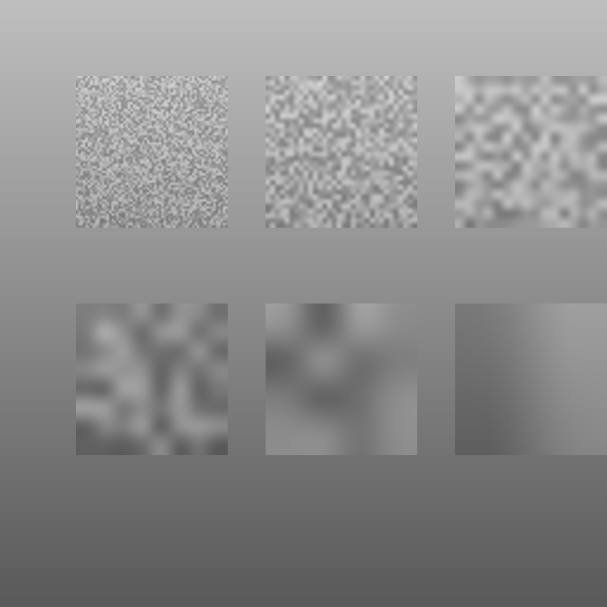

# High Frequency Mask

A ComfyUI node that builds a mask from an image's texture: **white where there is
detail, black where the image is flat.** Feed it to a sampler and only the detailed
regions get touched — skies, walls and skin stay exactly as they were.

Everything runs in torch on the GPU and handles batches.



## Inputs

> These are the current widget names, which are German. English names
> (`sensitivity`, `grow`, `feather`, `grain_suppress`, `highpass_radius`) are the
> next change, together with sliders and proper tooltips.

| input | what it does |
|---|---|
| `staerke` | how much of the image counts as detail |
| `groesse` | expand the white areas; negative shrinks them |
| `weichheit` | softness of the edge between white and black |
| `entrauschen` | smooths grain and JPEG artifacts before analysis |
| `invert` | swap: protect the detail, sample the flat areas |
| `samples` *(optional)* | if connected, the mask is attached as the latent's noise mask |
| `radius_override` | high-pass radius in px; `0` = automatic from image size |
| `black_override` / `white_override` | manual black/white points — see the caveat below |

Outputs: `mask`, `mask_preview` (as IMAGE), `latent`, `info`.

## Choosing a radius

The high-pass radius decides *which size of structure* counts as detail, and there is
no single right answer — the best value tracks the texture you are targeting:

| texture | best radius multiplier |
|---|---|
| 4px (grain, pores) | 0.5 |
| 8px (skin, fabric) | 0.7 |
| 16px (foliage) | 1.4 |
| 32px | 2.0 |
| 64px | 4.0 |

By default the node picks `min(W, H) / 52`, which targets roughly 16px structures and
holds up across resolutions (the same image at 768px and 2048px produces masks that
agree to IoU 0.87–0.98). For fine texture the default is about 2x too coarse.

Full measurements, method and comparison against other tools:
**[docs/radius-study.md](docs/radius-study.md)**.

## Known issues

Reproduced by the test suite — see [CLAUDE.md](CLAUDE.md) for the analysis.

- Images at or above ~4096x4096 raise `quantile() input tensor is too large`
- Large `radius_override` combined with high `weichheit` overflows the blur's padding
- `noise_mask` can reach the sampler with the wrong batch size
- `staerke` stops having any effect above ~1.4
- `black_override` / `white_override` are in **high-pass contrast**, not image
  brightness — useful values are near 0–30, not 0–255 — and setting either one
  silently disables `staerke` entirely

## Tests

`pytest` is not installed in the ComfyUI portable python, so the suite runs standalone:

```bash
python_embeded/python.exe ComfyUI/custom_nodes/high-frequency-mask/tests/run_tests.py
```

Known bugs are registered as `XFAIL`, so the suite is green today and turns red the
moment one is fixed without being removed from the list. `tests/test_radius.py` run
directly prints the full radius tables.

The fixture is generated, not photographic — regenerate it with
`python tests/assets/make_testchart.py`.

## Install

Clone into `ComfyUI/custom_nodes/` and restart ComfyUI. No extra dependencies beyond
what ComfyUI already ships.
