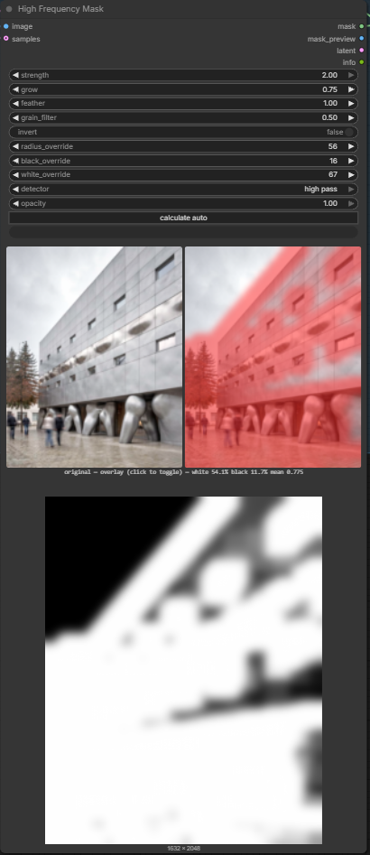

# High Frequency Mask — a ComfyUI Custom Node

**Stops an upscaler wrecking the flat parts of your image.**

Upscale and refine passes invent detail in surfaces that should stay smooth — skies,
walls, panels, skin — and drift the colour while doing it. **Flux Klein is especially
prone to both.** This node builds a mask from the image's own texture (white where
there is real detail, black where it is flat) and hands it to the sampler as a noise
mask. The flat regions are then never touched, so they keep their original tone and
stay clean.

Everything runs in torch on the GPU and handles batches.

## Wiring

Send `mask` into **Set Latent Noise Mask**, along with the latent you are about
to resample, and that into your sampler:

```
Image ──► High Frequency Mask ──mask──► Set Latent Noise Mask ──► KSampler
                                            ▲
Latent ─────────────────────────────────────┘
```

That is the intended use and what these defaults were tuned against. The node
can attach the mask itself if you connect a latent to its `samples` input, but
Set Latent Noise Mask reads more clearly in a graph.

There is a **calculate auto** button on the node: it measures the image this
node last processed and sets `strength` and `grain_filter` from it. The graph
has to have run once first — before that there is nothing to measure and the
button says so rather than guessing.

The node also shows a **live preview** that re-renders on every slider move —
no need to queue the graph to see the effect of a change. Original and mask sit
side by side, so you always have the source for context; click the mask to
toggle it to an overlay (source image tinted where the mask would sample),
which is the view that actually shows leak into flat areas. It works from the
same cached image as the auto button, so it also
needs one full run first.

## Can't make the mask weaker?

`strength` alone often looks stuck: raising `grow` re-dilates the white areas
back out as fast as `strength` shrinks them, so past a point the two fight
each other and the slider seems dead. Two ways out:

- Lower `grow` first — it dilates by `radius × 1.5 × grow` px, so at the auto
  radius even `grow 0.5` is already a ~15px max-filter that overwhelms small
  `strength` changes.
- Or use **`opacity`** (new): it caps the whole mask *after* grow and feather
  have run, so it reliably attenuates the result no matter what the other
  sliders are doing. `opacity 0.6` means even full-detail areas only reach
  60% — the direct answer to "the mask is too strong and nothing weakens it."

## Quick start for upscaling

Connect `image` from your source, `samples` from your latent, and the `latent` output
into the sampler. Then check these against the shipped defaults — they were tuned too
coarse for this job (`grain_filter` is now fixed at the right default; the radius is not):

| setting | default | use this | why |
|---|---|---|---|
| `radius_override` | 0 (auto ≈ 20 @1024) | **5–7 @1024, 10–14 @2048** | auto is ~3× too coarse; this is where protection peaks |
| `grain_filter` | **0.00** | 0.00, unless the source is grainy/JPEG | clean-render default now matches the tuned value |
| `feather` | 1.00 | **0.5–1.0** | soft edge, so the mask leaves no seam |
| `grow` | 1.00 | **0.5–1.0** | real detail keeps a safety margin |
| `opacity` | 1.00 | lower only if the mask is still too strong | caps the mask after grow/feather; see above |

Measured on two ComfyUI generations — flat-area leak is what an upscaler gets to
hallucinate into and shift the colour of:

| fixture | defaults | tuned | texture kept |
|---|---|---|---|
| concrete facade | .115 | **.048** | .298 → .405 |
| flat sky + snow field | .064 | **.011** | .305 → .404 |

Two to six times less leak *and* more real texture retained — not a trade-off. The
more flat area an image has, the more the coarse default costs you.

## The live preview

Original and mask side by side, right in the node — click the right panel to swap it
to the overlay. No need to queue the graph to see what a slider does.



## How it finds texture

`detector` chooses between two ways of measuring detail:

- **`guided`** (default) -- an edge-preserving low-pass, so strong edges do not
  spill a halo of false detail into the flat areas beside them. Sky next to a
  cliff and glass inside a window frame stay protected.
- **`high pass`** -- the original plain Gaussian difference, kept so older
  results can be reproduced.

Measured on the test renders at `grow 0`: the guided detector leaks **41x less**
into flat areas next to strong edges (.009 vs .371) while finding *more* real
texture (.515 vs .350). Full tables in
[docs/upscale-settings.md](docs/upscale-settings.md).

## Inputs

> These are the current widget names, which are German. English names
> (`sensitivity`, `grow`, `feather`, `grain_suppress`, `highpass_radius`) are the
> next change, together with sliders.

| input | what it does |
|---|---|
| `strength` | how much counts as detail. Nearly all the useful travel is below 1.2 |
| `grow` | expand the white areas; negative shrinks |
| `feather` | edge softness between white and black |
| `grain_filter` | pre-smoothing against grain and JPEG. Default 0; raise for grainy/JPEG sources |
| `invert` | swap: protect the detail, sample the flat areas |
| `samples` *(optional)* | if connected, the mask is attached as the latent's noise mask |
| `radius_override` | high-pass radius in px. `0` = automatic from image size |
| `black_override` / `white_override` | manual levels — see the caveat below |
| `opacity` | caps the mask after grow/feather. **The control that reliably weakens the mask** when `grow` fights `strength` |

Outputs: `mask`, `mask_preview` (as IMAGE), `latent`, `info`.

## Finding it, and help in the node

Double-click the canvas and search **upscale mask**, **protect flat areas**, **colour
shift**, **too much detail**, **flux klein**, **detail mask**, **high pass**, or the
German **Detailmaske** / **Flaechen schuetzen** / **Farbverschiebung**. 30 aliases, so
you needn't remember the node's name. It lives under **mask**.

Every input has an English tooltip on hover, all four outputs are documented, and the
node's help panel carries the settings guidance above.

## Fixed issues

Each was pinned by a regression test — see [CLAUDE.md](CLAUDE.md) for the analysis.

- ~~Images at or above ~4096×4096 raised `quantile() input tensor is too large`~~ —
  the level estimate now subsamples past `torch.quantile`'s 2²⁴-element ceiling.
- ~~Large `radius_override` with high `feather` overflowed the blur's padding~~ —
  the blur kernel is now clamped (and renormalised) to fit the image.
- ~~`noise_mask` could reach the sampler with the wrong batch size~~ — a mask
  batch between 1 and the latent batch is now tiled up to match instead of
  silently passing through unchanged.

## Known issues

- `black_override` / `white_override` are **high-pass contrast**, not brightness —
  useful values are near 0–30 — and setting either silently disables `strength`

## Install

Clone into `ComfyUI/custom_nodes/` and restart ComfyUI. No dependencies beyond ComfyUI.
