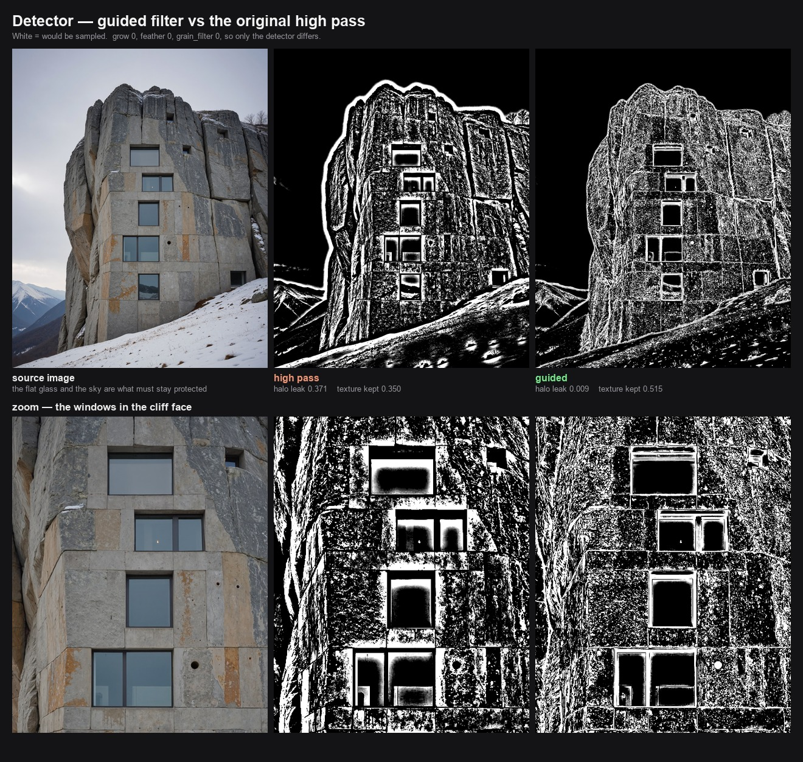
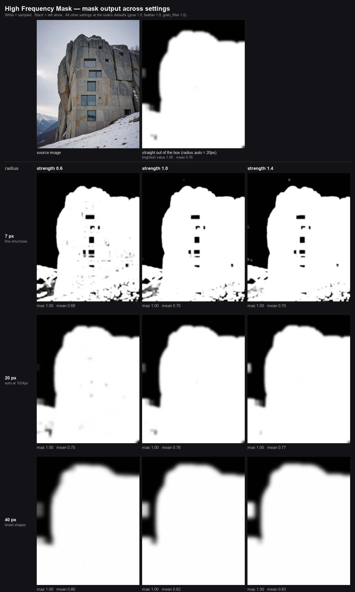
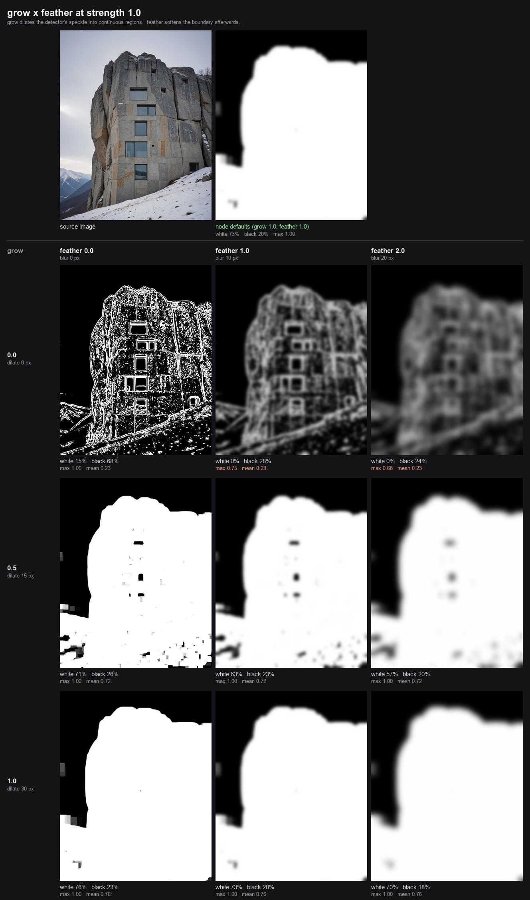

# High Frequency Mask

**Stops an upscaler wrecking the flat parts of your image.**

Upscale and refine passes invent detail in surfaces that should stay smooth — skies,
walls, panels, skin — and drift the colour while doing it. **Flux Klein is especially
prone to both.** This node builds a mask from the image's own texture (white where
there is real detail, black where it is flat) and hands it to the sampler as a noise
mask. The flat regions are then never touched, so they keep their original tone and
stay clean.

Everything runs in torch on the GPU and handles batches.

## Quick start for upscaling

Connect `image` from your source, `samples` from your latent, and the `latent` output
into the sampler. Then **change the defaults** — they ship tuned too coarse for this job:

| setting | default | use this | why |
|---|---|---|---|
| `radius_override` | 0 (auto ≈ 20 @1024) | **5–7 @1024, 10–14 @2048** | auto is ~3× too coarse; this is where protection peaks |
| `grain_filter` | 1.00 | **0.00** | on clean renders it smooths away real texture before measuring |
| `feather` | 1.00 | **0.5–1.0** | soft edge, so the mask leaves no seam |
| `grow` | 1.00 | **0.5–1.0** | real detail keeps a safety margin |

Measured on two ComfyUI generations — flat-area leak is what an upscaler gets to
hallucinate into and shift the colour of:

| fixture | defaults | tuned | texture kept |
|---|---|---|---|
| concrete facade | .115 | **.048** | .298 → .405 |
| flat sky + snow field | .064 | **.011** | .305 → .404 |

Two to six times less leak *and* more real texture retained — not a trade-off. The
more flat area an image has, the more the coarse default costs you.

## The grids

Every grid is generated from the node itself, so the numbers under each tile are
what you will actually get. Regenerate them with the scripts in `docs/`.

**Detector** — guided filter vs the original high pass, with a zoom on the
windows. `docs/make_detector_grid.py`



**Radius and strength** — which size of structure counts as detail, and how much
of it. `docs/make_grid.py`



**Grow and feather** — how the mask's shape and edges behave. Note the top row:
without `grow`, `feather` crushes the mask so it never reaches white at all.
`docs/make_edges_grid.py`



## How it finds texture

`detector` chooses between two ways of measuring detail:

- **`guided`** (default) -- an edge-preserving low-pass, so strong edges do not
  spill a halo of false detail into the flat areas beside them. Sky next to a
  cliff and glass inside a window frame stay protected.
- **`high pass`** -- the original plain Gaussian difference, kept so older
  results can be reproduced.

Measured on the test renders at `grow 0`: the guided detector leaks **41x less**
into flat areas next to strong edges (.009 vs .371) while finding *more* real
texture (.515 vs .350). Full tables in
[docs/upscale-settings.md](docs/upscale-settings.md).

## Inputs

> These are the current widget names, which are German. English names
> (`sensitivity`, `grow`, `feather`, `grain_suppress`, `highpass_radius`) are the
> next change, together with sliders.

| input | what it does |
|---|---|
| `strength` | how much counts as detail. Nearly all the useful travel is below 1.2 |
| `grow` | expand the white areas; negative shrinks |
| `feather` | edge softness between white and black |
| `grain_filter` | pre-smoothing against grain and JPEG. **Set 0 for clean sources** |
| `invert` | swap: protect the detail, sample the flat areas |
| `samples` *(optional)* | if connected, the mask is attached as the latent's noise mask |
| `radius_override` | high-pass radius in px. `0` = automatic from image size |
| `black_override` / `white_override` | manual levels — see the caveat below |

Outputs: `mask`, `mask_preview` (as IMAGE), `latent`, `info`.

## Finding it, and help in the node

Double-click the canvas and search **upscale mask**, **protect flat areas**, **colour
shift**, **too much detail**, **flux klein**, **detail mask**, **high pass**, or the
German **Detailmaske** / **Flaechen schuetzen** / **Farbverschiebung**. 30 aliases, so
you needn't remember the node's name. It lives under **mask**.

Every input has an English tooltip on hover, all four outputs are documented, and the
node's help panel carries the settings guidance above.

## Known issues

Each pinned by a test — see [CLAUDE.md](CLAUDE.md).

- Images at or above ~4096×4096 raise `quantile() input tensor is too large`.
  **This is reachable on a normal upscale.**
- Large `radius_override` with high `feather` overflows the blur's padding
- `noise_mask` can reach the sampler with the wrong batch size
- `black_override` / `white_override` are **high-pass contrast**, not brightness —
  useful values are near 0–30 — and setting either silently disables `strength`

## Tests

`pytest` is not installed in the ComfyUI portable python, so the suite runs standalone:

```bash
python_embeded/python.exe ComfyUI/custom_nodes/high-frequency-mask/tests/run_tests.py
```

Known bugs are `XFAIL`, so the suite is green today and turns red when one is fixed
without being deregistered. `tests/test_radius.py` run directly prints the radius
tables. Full measurements: **[docs/upscale-settings.md](docs/upscale-settings.md)**.

## Install

Clone into `ComfyUI/custom_nodes/` and restart ComfyUI. No dependencies beyond ComfyUI.
